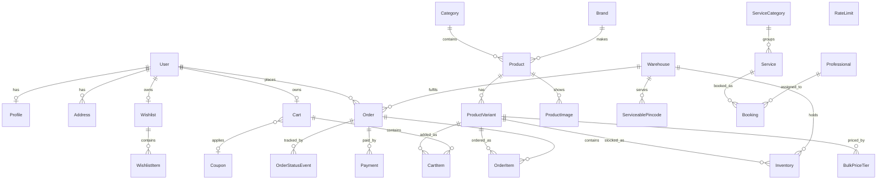

# CURRENT SYSTEM AUDIT — Vertical Express

**Repository:** `github.com/imareebkhan-design/vertical-express-new` @ `449f036` (single commit, "Add Capacitor scaffolding for iOS + Android apps")
**Live deployment:** https://www.verticalexpress.in (Vercel, `bom1` edge, prerendered)
**Audit date:** 6 August 2026
**Method:** full source inspection of the cloned repository + black-box probing of the live deployment
**Status:** NO CODE MODIFIED. This is an assessment only.

---

# 1. Executive Summary

## 1.1 The headline

**This is a substantially real system, not a prototype.** I expected a UI demo. What exists is a working Next.js 15 commerce application with a properly normalised PostgreSQL schema, a service layer with real domain logic, server actions, Supabase auth with route-level protection, an atomic race-free inventory decrement, order idempotency, a payment-provider abstraction with a complete Razorpay implementation, a signature-verifying webhook, an admin area, and a Capacitor mobile shell.

The previous Founding CTO Blueprint was written for a greenfield build. **It is now substantially obsolete, and roughly 60% of the infrastructure it proposed should be deleted from the plan** rather than built. That is the single most valuable outcome of this audit.

## 1.2 What is actually wrong

The problems are not architectural. They are three specific classes:

**Class 1 — Commercial correctness bugs that would cost real money on day one.** There are four, and one of them (GST) overcharges every customer by 18%.

**Class 2 — The catalog is entirely fictional.** Ten invented brands (`BuildPro`, `AquaSeal`, `FlowMax`, `GripFast`, `HomeCrown`, `LumenX`, `PowerCell`, `SteelEdge`, `TimberCraft`, `Voltix`), 45 invented products, invented prices. The *machinery* around the catalog is production-grade. The *contents* are placeholder. This is a data problem, not an engineering problem, and it is the largest single blocker to launch.

**Class 3 — The fulfilment half does not exist.** The chain runs `product → cart → checkout → order → confirmed` and stops. There is no shipment, no driver, no pick list, no proof of delivery, no COD reconciliation. Order status can reach `delivered` only by an admin manually clicking through statuses with no operational system behind it.

## 1.3 The verdict

**Keep ~78% of the existing project. Do not rebuild anything.**

The fastest safe path to production is: fix four correctness bugs (about 3 days), replace the fictional catalog with real data (blocked on you, not on engineering), switch auth from email OTP to phone OTP (about 2 days), activate Razorpay (about 1 day plus onboarding lead time), strip the demo/placeholder claims (about 1 day), and build the minimum fulfilment loop (about 5 days).

**That is roughly 3 working weeks of engineering to a launchable P0A** — against 10–14 weeks in the original blueprint. The existing codebase has saved you approximately two months.

## 1.4 The single most urgent finding

> **`PAYMENT_GATEWAY` defaults to `"dummy"`, and the dummy provider returns `settled: true` unconditionally.**
>
> `lib/services/payments.ts:DummyPaymentProvider.createPayment()` returns a fabricated `gateway_order_id`, marks the payment `captured`, sets `signatureVerified: true`, and the order transitions straight to `confirmed`. If the live site accepts an "online payment" order today, **an order is created and stock is decremented without any money moving.**
>
> The live site currently redirects `/checkout` to `/login`, so this is not presently exploitable by an anonymous visitor. But it is one Supabase signup away. **This must be gated before any real traffic.**

---

# 2. Repository Architecture

## 2.1 Structure

```
vertical-express-new/
├── actions/                    8 files   Server Actions ("use server") — the write layer
│   ├── address.ts  admin.ts  auth.ts  booking.ts
│   └── cart.ts  checkout.ts  orders.ts  wishlist.ts
├── app/                       Next.js 15 App Router
│   ├── (account)/account/     orders, addresses, wishlist, bookings
│   ├── (auth)/login/
│   ├── (shop)/                cart, categories, category/[slug], checkout,
│   │                          checkout/confirmation/[orderNo], product/[slug], search
│   ├── admin/                 layout(authz) + dashboard, orders, products, bookings
│   ├── api/                   search/suggest, serviceability/[pincode], webhooks/razorpay
│   ├── auth/confirm/          OTP/magic-link callback
│   ├── layout.tsx  page.tsx  error.tsx  global-error.tsx  not-found.tsx
│   └── robots.ts  sitemap.ts  globals.css
├── components/                60 components
│   ├── sections/              navbar, hero, deals, categories, footer, testimonials,
│   │                          trust-badges, app-banner, announcement-bar, funding-banner,
│   │                          services-promo, services/
│   ├── shop/                  product-gallery, pdp-actions, bulk-tier-table, cart-view,
│   │                          checkout-view, catalog-grid, filter-sheet, filter-sidebar,
│   │                          pagination, pincode-check, search-box, sort-select, empty-state
│   ├── account/  admin/  auth/  services/  ui/
│   └── product-card, category-card, service-card, floating-cart, welcome-popup, …
├── hooks/                     use-cart, use-lenis, use-scrolled
├── lib/
│   ├── services/              17 domain services — THE BUSINESS LOGIC LAYER
│   │   ├── catalog  cart  cart-merge  checkout  payments  orders  serviceability
│   │   ├── tax  users  addresses  wishlist  bookings  search  email
│   │   ├── rate-limit  auth-provider  admin/authz
│   ├── supabase/              client.ts, server.ts
│   ├── validators/index.ts    Zod schemas + ActionResult helpers
│   ├── data.ts                STATIC presentational data (nav, testimonials, footer, contact)
│   ├── db.ts  money.ts  utils.ts  services.ts
├── prisma/
│   ├── schema.prisma          25 models, 11 enums
│   ├── migrations/            6 migrations incl. rls_lockdown, order_idempotency_key
│   └── seed.ts  seed-services.ts
├── supabase/config.toml + templates/magic_link.html
├── mobile-shell/index.html    Capacitor web shell
├── docs/                      8 markdown docs (PRD, ARCHITECTURE, DATABASE_SCHEMA, …)
├── middleware.ts              Supabase session refresh + route protection
├── capacitor.config.ts        iOS + Android native shells
└── AUDIT_REPORT.md  PRODUCTION_CHECKLIST.md  PRODUCT_ROADMAP.md  task.md
```

**Scale:** 133 TypeScript/TSX files · **10,489 lines** of TS/TSX · 25 Prisma models · 6 migrations · 60 components · 17 services · 8 server-action modules.

## 2.2 Directory assessment

| Directory | Purpose | Quality | Production ready? | Action |
|---|---|---|---|---|
| `actions/` | Server Actions — all mutations | **High.** Auth checked at entry, Zod-validated, typed `ActionResult` discriminated union, error codes mapped to user messages | **Yes** | KEEP |
| `lib/services/` | Domain logic, `import "server-only"` on every file | **High.** Clean separation, no React leakage, provider abstractions for payments and OTP | **Mostly** | KEEP + fix 4 bugs |
| `lib/services/checkout.ts` | Order placement | **Good with 3 real defects** (§10.3) | **No** | REFACTOR |
| `lib/services/tax.ts` | GST | **Explicitly self-documented as DEMO MODE.** Flat 18%, placeholder HSN `7308`, applied on top of subtotal | **No** | REBUILD |
| `lib/services/payments.ts` | Gateway abstraction | **High.** Razorpay fully implemented, HMAC verification with `timingSafeEqual`. Dummy provider is the risk. | **Yes, once dummy is gated** | KEEP + gate |
| `lib/services/serviceability.ts` | Pincode lookup | **Adequate and correctly scoped.** 18 lines, one query | **Yes for MVP** | KEEP |
| `lib/data.ts` | Static nav/testimonials/footer/contact | **Presentational only** — correctly not used for commerce data | **No — contains fabrications** | REFACTOR (content) |
| `prisma/` | Schema + migrations | **High.** Proper normalisation, paise integers, snapshots, idempotency, RLS lockdown migration | **Yes, with additions** | EXTEND |
| `app/(shop)/` | Storefront routes | **High.** Server Components, ISR, real DB reads | **Yes** | KEEP |
| `app/admin/` | Admin area | **Thin.** 4 pages, env-allowlist authz, no RBAC, no audit log | **No** | EXTEND |
| `app/api/` | 3 route handlers | **Good.** Webhook is correct | **Yes** | KEEP |
| `components/` | UI | **High.** Tailwind 4, CVA variants, framer-motion, well-decomposed | **Yes** | KEEP + POLISH |
| `middleware.ts` | Session + route guard | **Correct.** Defense-in-depth noted in comments | **Yes** | KEEP |
| `mobile-shell/` + `capacitor.config.ts` | Native shells | **Scaffolded only.** No `ios/` or `android/` directories generated | **No** | KEEP (deferred) |
| `docs/` | 8 internal docs | **Useful but drifting** from code | Reference | KEEP + reconcile |
| **`__tests__`, `.github/`** | **DO NOT EXIST** | — | **No** | **CREATE** |

---

# 3. Technology Inventory

| Layer | Actual | Assessment |
|---|---|---|
| **Framework** | Next.js **15.5.20**, App Router, **Turbopack** for dev *and* build | Current. Matches blueprint recommendation exactly. |
| **React** | **19.1.0** | Current. |
| **TypeScript** | **5.x, `strict: true`**, `target: ES2017`, path alias `@/*` | Good. **Missing `noUncheckedIndexedAccess`** — recommend adding. |
| **Styling** | **Tailwind CSS v4** via `@tailwindcss/postcss` | Current. |
| **Components** | Hand-rolled + `class-variance-authority` + `tailwind-merge` + `clsx`. **No shadcn/ui, no Radix.** | Lean. Trade-off: no built-in accessibility primitives — see §12. |
| **Icons** | `lucide-react` 1.23 | Fine. |
| **Animation** | `framer-motion` 12.42, `gsap` 3.15, `lenis` 1.3.25 (smooth scroll) | **Three animation libraries.** Bundle risk — see §13. |
| **Package manager** | npm (`package-lock.json`, 288 KB) | Fine. |
| **Database** | **PostgreSQL via Supabase**, pooled (`pgbouncer`, port 6543) + direct (5432) for migrations, `ap-south-1` | Correct region. Correct pooling setup. |
| **ORM** | **Prisma 6.19.3** | Matches blueprint. |
| **Auth** | **Supabase Auth**, OTP. `AUTH_OTP_CHANNEL` env switch, defaults **`"email"`** | Provider abstraction is good. **Channel is wrong for the market** — see §7. |
| **Authorization** | Middleware prefix guard + `ADMIN_EMAILS` env allowlist | Adequate for MVP, not for a team. |
| **API architecture** | **Server Actions primary** + 3 REST route handlers | Sound. tRPC unnecessary. |
| **State** | React Context (`use-cart.tsx`) + server state | Appropriate. No Redux/Zustand needed. |
| **Validation** | **Zod 4.4.3** in `lib/validators/index.ts` | Good. |
| **Caching** | Next.js ISR/`revalidatePath`. **No Redis.** | Correct for current scale. |
| **Storage** | Static `/public` images. Supabase Storage available, unused. | Sufficient today. |
| **Search** | **Postgres `ILIKE`** (`lib/services/search.ts`) | Works at 45 SKUs. No typo tolerance — verified broken (§7). |
| **Analytics** | **NONE** | Gap. |
| **Error monitoring** | **NONE** | Gap. |
| **Payments** | **Razorpay implemented**; `dummy` active by default | See §1.4. |
| **Messaging** | `lib/services/email.ts` only. **No SMS, no WhatsApp.** | Gap. |
| **Maps/location** | **NONE.** Pincode text entry only. No lat/lng on `Address`. | Gap (acceptable for MVP). |
| **Mobile** | **Capacitor 8.4.2** (`@capacitor/ios`, `/android`, `/core`, `/cli`) + `mobile-shell/index.html` | Scaffolded, not built. **Better than the blueprint's TWA proposal.** |
| **Tests** | **ZERO.** No Vitest, Jest, Playwright, or test files. | **Critical gap.** |
| **CI/CD** | **No `.github/`.** Vercel git-push deploy. `vercel-build` runs `prisma migrate deploy`. | Gap — and migration-on-deploy is risky (§15). |
| **Linting** | ESLint 9 flat config, `next/core-web-vitals` + `next/typescript` | Adequate. No boundary rules. |
| **Formatting** | **No Prettier config.** | Minor gap. |
| **Security config** | RLS lockdown migration, DB rate limiter, HMAC verification, `server-only` guards | **Better than expected.** See §12. |

---

# 4. Route Inventory

| Route | Purpose | Implementation | Data source | Backend dep. | Prod ready? | Issues | Action |
|---|---|---|---|---|---|---|---|
| `/` | Homepage | **Complete** | DB (deals, categories) + `lib/data.ts` (testimonials, trust) | Prisma | ⚠️ | Fake testimonials, "4.9 Google", dead app links, educational-purposes footer | POLISH + strip claims |
| `/categories` | Category index | **Complete** | DB `Category` | Prisma | ✅ | — | KEEP |
| `/category/[slug]` | Category listing | **Complete** — filters, sort, pagination | DB | Prisma | ✅ | — | KEEP |
| `/product/[slug]` | PDP | **Complete** — gallery, specs, bulk ladder, pincode check, related | DB | Prisma | ✅ | Related products fall back to category image | KEEP + fix images |
| `/search` | Search + facets | **Complete** — brand facet, price range, 5 sort modes | DB `ILIKE` | Prisma | ⚠️ | **No typo tolerance** (verified: `cementt` → 0 results) | KEEP + improve |
| `/cart` | Cart | **Complete** — live tier pricing, free-delivery meter | DB `Cart`/`CartItem` | Prisma | ✅ | Prices exclude GST added later | KEEP + fix GST |
| `/checkout` | Checkout | **Complete** — address select, totals, COD/online | DB + serviceability | Prisma, payments | ❌ | **GST-on-top bug, dummy gateway** | FIX (P0A) |
| `/checkout/confirmation/[orderNo]` | Confirmation | **Complete** | DB `Order` | Prisma | ✅ | — | KEEP |
| `/login` | Auth | **Complete** — OTP flow | Supabase Auth | Supabase | ❌ | **Email OTP, not phone** | REFACTOR (P0A) |
| `/auth/confirm` | OTP callback | **Complete** | Supabase | Supabase | ✅ | — | KEEP |
| `/account` | Dashboard | **Complete** | DB | Prisma | ✅ | — | KEEP |
| `/account/orders` | Order history | **Complete** | DB | Prisma | ✅ | — | KEEP |
| `/account/orders/[orderNo]` | Order detail | **Complete** — status timeline | DB + `OrderStatusEvent` | Prisma | ✅ | No invoice download | KEEP + extend |
| `/account/addresses` | Address book | **Complete** — CRUD, default, soft delete | DB | Prisma | ✅ | No lat/lng, no map | KEEP |
| `/account/wishlist` | Wishlist | **Complete** | DB | Prisma | ✅ | — | KEEP |
| `/account/bookings` | Service bookings | **Complete** | DB `Booking` | Prisma | ✅ | — | KEEP |
| `/services` | Services marketing | **Complete** — categories, booking modal | DB `Service*` | Prisma | ⚠️ | Claims "background-checked", "delay penalties" — unverified | KEEP + verify claims |
| `/admin` | Dashboard | **Thin** — counts only | DB | Prisma | ⚠️ | No RBAC, no audit log | EXTEND |
| `/admin/orders` | Order management | **Basic** — list + status control | DB | Prisma | ⚠️ | No transition enforcement, no dispatch, no pick list | EXTEND (P0A) |
| `/admin/products` | Product list | **Read-only** | DB | Prisma | ❌ | **No create/edit/import** | BUILD (P0A) |
| `/admin/bookings` | Booking management | **Basic** | DB | Prisma | ⚠️ | — | KEEP |
| `/api/search/suggest` | Typeahead | **Complete** | DB `ILIKE` | Prisma | ⚠️ | No typo tolerance | KEEP + improve |
| `/api/serviceability/[pincode]` | Pincode check | **Complete** | DB | Prisma | ✅ | — | KEEP |
| `/api/webhooks/razorpay` | Payment webhook | **Complete** — HMAC verify, dedupe by `event.id` | DB | Prisma | ✅ | Returns 401 on bad sig (correct); no amount check | KEEP + harden |
| `/robots.ts`, `/sitemap.ts` | SEO | **Complete** | DB | Prisma | ❌ | **Emits `new-virticalexpress.vercel.app`** | FIX (P0A) |
| **`/about`, `/contact`, `/faq`, `/price-lists`, `/policies/*`** | **DO NOT EXIST** — all footer links are `href: "#"`, all URLs 404 | — | — | — | ❌ | **No legal pages** | BUILD (P0A) |

---

# 5. Component Inventory

| Component | Classification | Why |
|---|---|---|
| `sections/navbar.tsx` | **KEEP** | Location chip, search, cart, responsive. Solid. |
| `sections/hero.tsx` | **KEEP + POLISH** | Remove "60 minutes" until ops confirm |
| `sections/deals.tsx` | **KEEP** | Real DB-driven |
| `sections/categories.tsx` | **KEEP** | Clean |
| `sections/footer.tsx` | **REFACTOR** | **All links `href:"#"`; contains "recreated for educational purposes"; email domain `.co` ≠ site `.in`** |
| `sections/testimonials.tsx` | **KEEP (component) / REMOVE (content)** | Component fine. Content fabricated. |
| `sections/trust-badges.tsx` | **KEEP + POLISH** | "4.9 Google Rating", "thousands of builders" unverified |
| `sections/app-banner.tsx` | **REMOVE (for now)** | Links are `#`. Advertises apps that do not exist. |
| `sections/announcement-bar.tsx` | **KEEP** | Move strings to DB/CMS at P1 |
| `sections/funding-banner.tsx` | **REMOVE** | Mirrors HomeRun's Series A banner. No funding to announce. |
| `sections/services-promo.tsx` | **KEEP** | |
| `product-card.tsx` | **KEEP** | Image, discount, brand, price, unit, qty stepper, add — matches the good HomeRun pattern |
| `shop/bulk-tier-table.tsx` | **KEEP** | **Genuinely better than the reference site.** Full ladder visible, no login wall. |
| `shop/pdp-actions.tsx` | **KEEP** | |
| `shop/pincode-check.tsx` | **KEEP + EXTEND** | Works; needs suspension + per-item states |
| `shop/cart-view.tsx` | **KEEP + FIX** | GST display |
| `shop/checkout-view.tsx` | **REFACTOR** | GST-on-top bug surfaces here |
| `shop/catalog-grid.tsx`, `filter-sidebar`, `filter-sheet`, `sort-select`, `pagination` | **KEEP** | Complete and correct |
| `shop/search-box.tsx` | **KEEP** | |
| `shop/product-gallery.tsx` | **KEEP** | |
| `shop/empty-state.tsx` | **KEEP** | |
| `account/*` (nav, address-form, address-manager, order-actions, order-status-badge) | **KEEP** | |
| `auth/login-form.tsx` | **REFACTOR** | Email → phone input, `inputmode="numeric"`, +91 prefix |
| `auth/account-button.tsx` | **KEEP** | |
| `admin/status-control.tsx` | **REFACTOR** | No transition validation |
| `services/booking-modal.tsx` | **KEEP** | |
| `ui/button.tsx`, `input.tsx`, `badge.tsx`, `logo.tsx` | **KEEP** | CVA-based, clean |
| `placeholder-image.tsx` | **KEEP** | Good fallback pattern |
| `floating-cart.tsx` | **KEEP** | |
| `welcome-popup.tsx` | **REVIEW** | Interstitials hurt mobile conversion and LCP |
| `magnetic.tsx`, `reveal.tsx`, `animated-counter.tsx`, `page-loader.tsx`, `hooks/use-lenis.tsx` | **REVIEW → likely REMOVE** | Decorative. Cost: gsap + lenis + framer-motion on low-end Android. See §13. |

**Component verdict: 52 of 60 KEEP or KEEP+POLISH. The UI layer is the strongest part of this codebase.**

---

# 6. Data Architecture

## 6.1 Where the data actually comes from

| Data | Source | Real? |
|---|---|---|
| Products (45) | **`prisma/seed.ts` → Postgres** | ❌ **Invented** |
| Brands (10) | `prisma/seed.ts` | ❌ **Invented**: BuildPro, AquaSeal, Voltix, TimberCraft, GripFast, LumenX, SteelEdge, FlowMax, HomeCrown, PowerCell |
| Categories (20) | `prisma/seed.ts` | ⚠️ **Structure mirrors HomeRun's taxonomy closely** — including a "Fevicol" category with no Fevicol products |
| Prices / MRP / bulk tiers | `prisma/seed.ts` (rupees → paise) | ❌ **Invented** |
| Inventory | `prisma/seed.ts` | ❌ **Invented** |
| Images | `/public/products/*.webp` (25 files) | ⚠️ Only ~6 real product images; rest fall back to category images |
| Specs | Seed `specs` JSON | ❌ Sparse, invented |
| Warehouse | Seed: "Srinagar Central", pincode 190001 | ⚠️ Placeholder |
| Serviceable pincodes | Seed | ⚠️ Placeholder |
| Services / categories | `prisma/seed-services.ts` | ⚠️ Plausible but unverified |
| **Testimonials** | **`lib/data.ts` hardcoded** | ❌ **Fabricated** |
| Nav, announcements, trust badges, footer, contact | `lib/data.ts` hardcoded | ⚠️ Static; contact address unverified |

**The critical distinction: commerce data lives in Postgres and flows through real queries. Only presentational chrome is hardcoded. The architecture is correct; the contents are placeholder.**

## 6.2 Current model vs required production model

| Concern | Current | Required | Gap |
|---|---|---|---|
| Money | `Int` paise everywhere | ✅ Correct | Consider `BigInt` only if an order could exceed ₹2.14 crore |
| Product identity | `slug`, `title`, `brandId`, `categoryId` | ✅ | — |
| **Unit of measure** | `unitLabel: String` ("per bag") | Structured `uom` enum + `packSize` + `packUnit` | **Cannot compute ₹/kg. Cannot validate quantity steps.** |
| **Weight / dimensions** | **Absent** | Required for vehicle class + delivery fee | **Missing** |
| **HSN / GST rate** | Hardcoded `"7308"` @ 18% for everything | Per-product `hsnCode` + `taxRatePercent` | **Legally required. Missing.** |
| Variants | `ProductVariant` + JSON `attributes` | ✅ | — |
| Bulk pricing | `BulkPriceTier(variantId, minQty, pricePaise)` | ✅ Works | Add tier-by-customer-segment at P1 |
| **Customer tier** | **Absent** | Contractor/trade pricing | **Missing** (P1) |
| Inventory | `qtyOnHand`, `qtyReserved`, `lowStockThreshold` per (variant, warehouse) | ✅ | `qtyReserved` is written but **never used** — no reservation lifecycle |
| **Inventory ledger** | **Absent** | Movement audit trail | **Missing** — cannot answer "where did 40 bags go" |
| Serviceability | `ServiceablePincode(pincode → warehouse, eta, fee, cod)` | ✅ **Right-sized for MVP** | Add `isActive` suspension use + zone grouping at P1 |
| **Geo** | No lat/lng on `Address` | Landmark + coordinates | **Missing** (P1) |
| Cart | `Cart` (user or anon) + `CartItem` — **no price stored** | ✅ **Correct — prices resolved server-side** | — |
| Order | Snapshots address, title, variantName, unitPrice, appliedTier | ✅ **Correct** | Missing HSN + tax per line |
| Order idempotency | `idempotencyKey @unique` + P2002 catch | ✅ **Correct** | — |
| Payment | `gatewayEventId @unique`, `signatureVerified` | ✅ **Correct** | No amount reconciliation |
| **Refunds** | Only `PaymentStatus.refunded` | Refund entity + workflow | **Missing** |
| Coupons | Full `Coupon` model | ⚠️ **Modelled but not wired** — `discountPaise` is hardcoded `0` in `computeTotals` | Wire it |
| **Coupon redemption** | **Absent** | Per-user usage tracking | **Missing** |
| Order events | `OrderStatusEvent` with from/to/actor | ✅ **Good** | — |
| **Shipment / Driver / POD** | **Absent** | Delivery ops | **Missing — the biggest gap** |
| **COD reconciliation** | **Absent** | Cash tracking | **Missing** |
| **Audit log** | **Absent** | Money/stock/price actions | **Missing** |
| Rate limiting | `RateLimit` table, fixed window | ✅ Works serverless | **Fails open** on error |

---

# 7. Functional Reality Check

**Legend:** A = fully functional · B = partial · C = UI only/mock · D = hardcoded · E = broken · F = not implemented

| Feature | Status | Evidence |
|---|---|---|
| Search | **B** | Real Postgres `ILIKE` over title + brand. **Verified broken for typos:** `/search?q=cementt` → "0 products". No synonyms, no description/SKU match. |
| Filters | **A** | Brand facet with counts, price range — real query params |
| Sorting | **A** | Popular / price asc / price desc / discount / newest |
| Product variants | **B** | Schema + seed support them; **seed creates exactly one default variant per product**, so the UI is untested against multi-variant |
| Quantity controls | **A** | Stepper, capped at 999 |
| Add to cart | **A** | Server action → DB upsert |
| Persistent cart | **A** | DB-backed for user *and* guest (`anonId`); `cart-merge.ts` exists for login merge |
| Location selection | **B** | Pincode entry works; **header shows a hardcoded "190001 — 60 min" default** |
| Pincode serviceability | **A** | Real DB lookup, real ETA/fee/COD flags |
| Geo serviceability | **F** | No coordinates anywhere |
| **Bulk pricing** | **A** | **Fully working.** Ladder on PDP, applied live in cart, `appliedTierMinQty` snapshotted onto the order. **This is the best-implemented feature in the codebase.** |
| Discounts (compare-at) | **A** | `discountPercent()` from `compareAtPaise` |
| **Coupons** | **C** | Full `Coupon` model, `Cart.couponId` FK — but `computeTotals` sets `discountPaise = 0` unconditionally. **Dead code path.** |
| Authentication | **B** | Supabase OTP works — **but via email, not phone** |
| OTP | **B** | `auth-provider.ts` abstracts channel; `AUTH_OTP_CHANNEL` defaults `"email"`. Comment admits the free-tier template sends a **link, not a code** |
| Addresses | **A** | Full CRUD, default handling, soft delete, ownership checks |
| Checkout | **B** | Complete flow — **with the GST bug** |
| COD | **A** | Gated on `ServiceablePincode.codAllowed`. No value cap, no new-customer limit. |
| Online payments | **C/E** | **Razorpay fully coded but inactive. `dummy` gateway confirms orders with no money.** |
| Order creation | **A** | Transactional, idempotent, snapshotted, atomic stock decrement |
| Order history | **A** | Real |
| Order tracking | **B** | Status timeline from `OrderStatusEvent`. No public shareable link. No live tracking. |
| **Invoices** | **F** | No PDF, no GST invoice, no invoice number |
| Notifications (email) | **B** | `sendOrderConfirmationEmail` exists — **needs verification that a provider is actually wired** |
| Notifications (SMS) | **F** | None |
| WhatsApp | **F** | None. No `wa.me` link anywhere. |
| **Delivery / dispatch / driver / POD** | **F** | **Entirely absent** |
| App download links | **C** | `href="#"` — advertises non-existent apps |
| Services browsing | **A** | DB-driven |
| Consultation/booking | **A** | `Booking` model, server action, admin view |
| Contact forms | **F** | Footer "Contact" → `#`, `/contact` 404 |
| Newsletter | **C** | Input renders; no submit handler found |
| Reviews | **C** | `ratingAvg`/`ratingCount` on `Product`, seeded — **no review submission or storage** |
| Google rating | **D** | "Rated 4.9 on Google" hardcoded |
| Admin — orders | **B** | List + status change; no validation, no dispatch |
| Admin — products | **B** | **Read-only list. No create/edit/import.** |
| Admin — bookings | **B** | Basic |
| Admin — inventory/pricing/zones/customers/coupons | **F** | Not built |

---

# 8. Public Claims / Placeholder Audit

**Every item below is on the live production site today.**

| Claim | Classification | Action |
|---|---|---|
| **"recreated for educational purposes"** (footer, `footer.tsx:118`) | **DEMO/PLACEHOLDER** | **REMOVE IMMEDIATELY.** Undermines every other claim on the site. |
| "Construction materials in 60 minutes" (H1) | **STATIC MARKETING CLAIM** | **Do not publish until ops confirm.** Blueprint §21.3 recommends launching at "same day". |
| "Avg. delivery 60 min" | STATIC MARKETING CLAIM | Same |
| Header "190001 — 60 min" | **HARDCODED DEFAULT** | Should be empty until the user sets a location |
| **"Rated 4.9 on Google"** (×2) | **DEMO/PLACEHOLDER** | **REMOVE** until a real Google Business Profile with real reviews exists. Fabricated ratings are actionable under consumer-protection law. |
| **"Loved by thousands of builders & homeowners"** | **DEMO/PLACEHOLDER** | **REMOVE.** Order table is empty. |
| **5 testimonials** (Ravi Kumar/Hyderpora, Anita Sharma/Rajbagh, Mohammed Irfan/Lal Chowk, Deepa Nair/Nishat, Suresh Gowda/Bemina) | **DEMO/PLACEHOLDER — fabricated** | **REMOVE.** Attributing invented quotes to named individuals in named Srinagar localities is a real legal and reputational exposure. |
| "100% genuine brands, sourced directly" | **OWNER CONFIRMATION REQUIRED** | Needs authorised-dealer documentation |
| **App Store / Google Play badges** | **DEMO/PLACEHOLDER — `href="#"`** | **REMOVE.** No app is published. |
| "Track deliveries live, reorder in one tap, app-only offers" | **DEMO/PLACEHOLDER** | REMOVE with the app banner |
| Funding banner component | **DEMO/PLACEHOLDER** | REMOVE |
| **`hello@verticalexpress.co`** | **PLACEHOLDER — wrong TLD** (site is `.in`) | **FIX.** Verify the mailbox exists. |
| "Vertical Express Commerce, Residency Road, Lal Chowk, Srinagar 190001" | **OWNER CONFIRMATION REQUIRED** | Structurally mirrors HomeRun's own footer address format. Confirm it is your real godown/office. |
| **No phone number anywhere** | **GAP** | A local trade business without a visible phone number will not be trusted |
| "Free delivery for first 3 orders above ₹500" (announcement) | **NOT BACKED BY SOFTWARE** | Coupon engine is dead code. This promise cannot currently be honoured. |
| Services: "background-checked and skill-verified" | **OWNER CONFIRMATION REQUIRED** | |
| Services: "delay penalties written into every contract" | **OWNER CONFIRMATION REQUIRED** | This is a contractual commitment |
| Services: "Stage-wise quality checks with photo updates" | **NOT BACKED BY SOFTWARE** | No photo system exists |
| All 10 brand names | **FABRICATED** | Replace with real stocked brands |
| All 45 products + prices | **FABRICATED** | Replace with real catalog |
| Footer legal links (9 × `href="#"`) | **MISSING** | **Legally required before taking payments in India** |

---

# 9. UI/UX Gap Analysis

| Area | Vertical Express (now) | HomeRun | Recommended V2 | Verdict |
|---|---|---|---|---|
| **Header** | Logo, location chip, login, cart, 4 nav links | Logo, mega menu, pincode modal, search, login, cart | Keep ours; add persistent search on mobile | **KEEP OUR VERSION** |
| **Navigation** | Flat: Materials / Services / About / Contact | 5-group mega menu | Add a category mega menu on desktop; keep bottom nav on mobile | **ADOPT THE FUNCTIONAL PATTERN** |
| **Location/serviceability** | Pincode entry → real ETA/fee/COD from DB | Pincode only, static "60 Mins" badge | Ours + suspension state + per-item fulfilment class | **IMPROVE BEYOND BOTH** — ours is already better |
| **Homepage** | Hero, deals, categories, app banner, testimonials, trust, services | Hero, deals, collections, testimonials, trust | Ours minus fabricated blocks; add seasonal merchandising | **KEEP OUR VERSION** |
| **Category discovery** | 20 flat category tiles | 5 groups → subcategories | Introduce the group level (schema already has `CategoryGroup`) | **ADOPT THE FUNCTIONAL PATTERN** |
| **Search** | Facets + 5 sorts, **no typo tolerance** | Typeahead, typo-tolerant | Ours + trigram/typo + synonyms | **IMPROVE BEYOND BOTH** |
| **Product listing** | Grid + sidebar filters + sheet on mobile | Grid + inline variant on card | Add **inline variant selection on card** | **ADOPT THE FUNCTIONAL PATTERN** |
| **Product card** | Image, discount, brand, title, price, unit, "Bulk prices available", stepper, Add | Same **+ benefit strip (60min/COD/free delivery) + inline variants** | Add benefit strip + stock indicator | **ADOPT + IMPROVE** |
| **Product detail** | Gallery, bulk ladder, delivery check, specs, related | Gallery, price, variants, "Unlock Bulk Prices" (broken) | Ours + sticky mobile add bar | **KEEP OUR VERSION** |
| **Bulk pricing** | **Full ladder visible, no login, live in cart, snapshotted to order** | **Publicly refuses bulk discounts**; teaser renders "Rs. ___" | Add contractor tier on top | **WE ALREADY WIN — extend the lead** |
| **Cart** | Line tiers, free-delivery meter, savings | Drawer + page | Add cart drawer; fix GST | **ADOPT drawer pattern** |
| **Checkout** | Address → totals → COD/online, idempotent | Shopify checkout | Ours + stepped mobile UX | **KEEP OUR VERSION** |
| **Authentication** | **Email OTP** | Mobile OTP | **Phone OTP** | **ADOPT THE FUNCTIONAL PATTERN — this is a market requirement** |
| **Account** | Orders, addresses, wishlist, bookings | Orders, addresses | Ours + saved sites | **KEEP OUR VERSION** |
| **Orders** | History + timeline | History | Ours + invoice + one-tap reorder | **IMPROVE BEYOND BOTH** |
| **Tracking** | Status timeline | SMS + app tracking | Add SMS/WhatsApp + public share link | **ADOPT THE FUNCTIONAL PATTERN** |
| **Trust** | Badges + testimonials — **all fabricated** | Video testimonials, real Google rating, funding press | Real local proof: godown photos, real phone, real supplier names | **REBUILD WITH REAL CONTENT** |
| **Content** | **None** — no FAQ/about/policies/blog | FAQ, Knowledge Hub, Price Lists, policies, calculator | Policies (P0A) + FAQ + calculator (P1) | **ADOPT — and legally required** |
| **Mobile** | Responsive, filter sheet, floating cart | Responsive + native apps | Ours + reduce animation payload | **KEEP + optimise** |
| **Footer** | Structure good, **all links dead** | Fully linked | Wire every link | **FIX** |

**Overall UX verdict: the existing product is already ahead of the reference on bulk pricing, serviceability data, and account depth. It is behind on navigation depth, search quality, inline variants, and content.**

---

# 10. Backend Audit

## 10.1 A genuine backend exists

Three layers, cleanly separated:

```
UI (Client Component)
   ↓ calls
Server Action  (actions/*.ts, "use server")
   ↓ auth check → Zod validate → calls
Domain Service (lib/services/*.ts, "server-only")
   ↓
Prisma → PostgreSQL (Supabase, pooled)
```

Plus 3 route handlers for things that cannot be actions: typeahead (`GET`), pincode check (`GET`), Razorpay webhook (external `POST`).

## 10.2 Full trace: PRODUCT → DISPLAY → CART → CHECKOUT → ORDER

```
1. DISPLAY
   app/(shop)/product/[slug]/page.tsx        (Server Component)
     → lib/services/catalog.ts               getProductBySlug()
       → Prisma: product + brand + category + images + variants + bulkTiers + inventory
     → components/shop/pdp-actions.tsx       (Client)
     → components/shop/bulk-tier-table.tsx   renders the ladder
     → components/shop/pincode-check.tsx     → GET /api/serviceability/[pincode]
                                               → lib/services/serviceability.ts

2. ADD TO CART
   pdp-actions.tsx → actions/cart.ts::addToCart(variantId, qty)
     → lib/services/cart.ts::addItem()
       → getOrCreateCart(userId | anonId)    upsert
       → validate variant isActive
       → db.cartItem.upsert  { qty: increment }
     → revalidatePath("/cart")

3. CART VIEW
   app/(shop)/cart/page.tsx
     → lib/services/cart.ts::getCartSummary()
       → tierPrice(basePaise, tiers, qty)    ← BULK RESOLUTION, server-side
       → lineTotal = unitPaise × qty
       → free-delivery meter (₹500 threshold, hardcoded constant)
     NOTE: CartItem stores NO price. Correct.

4. CHECKOUT
   components/shop/checkout-view.tsx
     → actions/checkout.ts::getCheckoutTotals(pincode)
       → lib/services/checkout.ts::computeTotals()
         → checkServiceability(pincode)      → ETA, fee, codAllowed
         → computeGst(subtotal, state)       ← BUG: adds 18% ON TOP
         → total = subtotal + tax + deliveryFee

5. PLACE ORDER
   → actions/checkout.ts::placeOrder({ addressId, paymentMethod, idempotencyKey })
     → supabase.auth.getUser()               AUTH GATE
     → activeGateway()                       → "dummy" unless Razorpay keys present
     → lib/services/checkout.ts::placeOrder()
        a. idempotencyKey lookup → early return if seen
        b. address ownership check
        c. getCartSummary → computeTotals
        d. serviceable? codAllowed?
        e. resolve warehouse from ServiceablePincode
        f. db.$transaction:
             provider.createPayment()        ← ⚠️ EXTERNAL HTTP INSIDE TRANSACTION
             order.create { snapshot address, items, payment, statusEvent }
             FOR EACH line:
               inventory.updateMany({ where: { qtyOnHand: { gte: qty } },
                                      data: { decrement } })
               if count === 0 → throw OUT_OF_STOCK → rollback all
             cartItem.deleteMany
        g. catch P2002 on idempotencyKey → return the winning order
     → emailOrderConfirmation() for COD/dummy

6. PAYMENT CONFIRMATION (Razorpay path)
   Client → Razorpay Checkout → callback
     → actions/checkout.ts::confirmRazorpayPayment()
       → verifyRazorpaySignature()           HMAC + timingSafeEqual
       → markOrderPaid()                     idempotent no-op if already confirmed
   AND independently:
   Razorpay → POST /api/webhooks/razorpay
       → verifyRazorpayWebhook(rawBody, sig) → 401 if invalid
       → dedupe on payment.gatewayEventId
       → markOrderPaid()

7. WHERE THE CHAIN STOPS  ◀───────────────────────────────
   Order status = "confirmed".
   An admin can manually click confirmed → packed → out_for_delivery → delivered.
   There is NO: shipment, driver, assignment, pick list, packing slip,
   delivery OTP, proof of delivery, COD collection record, cash reconciliation.
   The operational half of the business has no software.
```

## 10.3 Backend defects found

| # | Severity | File | Defect |
|---|---|---|---|
| **B1** | **CRITICAL** | `lib/services/tax.ts` + `checkout.ts:computeTotals` | **GST is added on top of the displayed price.** Product shows ₹320/bag; `totalPaise = subtotal + 18% + fee`. Customer is charged ₹377.60 for a ₹320 item. Indian retail prices are GST-*inclusive*. |
| **B2** | **CRITICAL** | `lib/services/payments.ts` | `activeGateway()` returns `"dummy"` unless Razorpay keys are set. `DummyPaymentProvider` returns `settled: true` → order `confirmed`, payment `captured`, `signatureVerified: true`, **stock decremented, no money taken.** |
| **B3** | **HIGH** | `lib/services/checkout.ts:placeOrder` | `provider.createPayment()` — an **external HTTPS call to Razorpay — executes inside `db.$transaction`**. Holds a pooled connection across network latency. Under load: transaction timeouts and pool exhaustion. |
| **B4** | **HIGH** | `lib/services/checkout.ts:placeOrder` | Inventory decrement: `where: { variantId, ...(warehouseId ? {warehouseId} : {}) }`. **If no warehouse resolves, `updateMany` decrements the variant's stock at *every* warehouse.** Currently masked by having one warehouse. |
| **B5** | **HIGH** | `lib/services/checkout.ts:markOrderPaid` | **Does not verify the paid amount matches `order.totalPaise`.** A tampered or mismatched capture confirms the order. |
| **B6** | MEDIUM | `lib/services/checkout.ts:computeTotals` | `discountPaise = 0` hardcoded. **The entire `Coupon` model is unreachable code** — yet the site advertises "Free delivery for first 3 orders". |
| **B7** | MEDIUM | `lib/services/rate-limit.ts` | `catch { return { allowed: true } }` — **fails open**. Correct for UX, wrong for the OTP endpoint specifically. |
| **B8** | MEDIUM | `admin/status-control.tsx` + `actions/admin.ts` | **No status-transition validation.** `delivered → pending_payment` is accepted. |
| **B9** | MEDIUM | `lib/services/cart.ts` | `getCartSummary` computes `inStock` but **`addItem` never checks stock**. Over-add is possible; only caught at checkout. |
| **B10** | LOW | `lib/services/checkout.ts:orderNumber()` | `Date.now().toString(36) + random` — not sequential. Harder to read over the phone than `VE-2026-000123`, and gaps look like missing orders to an accountant. |
| **B11** | LOW | `app/api/webhooks/razorpay/route.ts` | Only handles `payment.captured`. `payment.failed`, `refund.processed` ignored. |
| **B12** | LOW | `lib/services/cart.ts` | `FREE_DELIVERY_THRESHOLD_PAISE = 50000` hardcoded in source, not configurable. |

---

# 11. Database Audit

## 11.1 Current ERD



**25 models · 11 enums · 6 migrations.** Migration history shows deliberate hardening: `rls_lockdown`, `order_idempotency_key`, `rate_limits`, `order_tax_paise`.

## 11.2 Blueprint entity reconciliation

| Blueprint entity | Verdict |
|---|---|
| Users, Addresses | **ALREADY EXISTS** — `User`, `Profile`, `Address` (with `landmark`!) |
| Warehouses | **ALREADY EXISTS** |
| ServiceAreas / Pincodes | **ALREADY EXISTS** as `ServiceablePincode` (simpler, better-scoped) |
| **DeliveryZones (PostGIS polygons)** | **NOT REQUIRED FOR MVP** — `ServiceablePincode` is sufficient. Revisit at multi-city. |
| Categories, Subcategories | **EXTEND EXISTING** — `CategoryGroup` enum exists but no parent/child tree. Add `parentId`. |
| Brands | **ALREADY EXISTS** |
| Products, ProductVariants, ProductImages | **ALREADY EXISTS** |
| Attributes | **ALREADY EXISTS** as JSON on variant |
| Prices | **ALREADY EXISTS** — `pricePaise` + `compareAtPaise` |
| BulkPricingRules | **ALREADY EXISTS** as `BulkPriceTier` — **and working** |
| **PriceRule / CustomerTier** | **NEW TABLE REQUIRED (P1)** — contractor pricing |
| **PriceAuditLog** | **NEW TABLE REQUIRED (P0B)** |
| Inventory | **ALREADY EXISTS** |
| **InventoryReservations** | **NOT REQUIRED FOR MVP** — stock decrements atomically at order placement, which is simpler and correct for a synchronous checkout. Only needed if you add a hold-before-payment flow. |
| **InventoryMovement (ledger)** | **NEW TABLE REQUIRED (P0B)** |
| Carts, CartItems | **ALREADY EXISTS** |
| **CheckoutSession** | **NOT REQUIRED** — placement is a single atomic action; a session table adds state for no benefit |
| Orders, OrderItems | **ALREADY EXISTS** (with idempotency + snapshots) |
| Payments | **ALREADY EXISTS** (with `gatewayEventId` dedupe) |
| **Refunds** | **NEW TABLE REQUIRED (P0B)** |
| **Shipments** | **NEW TABLE REQUIRED (P0A)** |
| **Drivers** | **NEW TABLE REQUIRED (P0A)** |
| **CodCollection / CodDeposit** | **NEW TABLE REQUIRED (P0A)** |
| Coupons | **ALREADY EXISTS** — needs wiring, not building |
| **CouponRedemption** | **NEW TABLE REQUIRED (P0B)** |
| Reviews | **NEW TABLE REQUIRED (P1)** — `ratingAvg` exists with nothing behind it |
| Wishlists | **ALREADY EXISTS** |
| **Notifications log** | **NEW TABLE REQUIRED (P0B)** |
| SupportTickets | **NOT REQUIRED FOR MVP** — WhatsApp + phone |
| **AuditLogs** | **NEW TABLE REQUIRED (P0B)** |
| Product `hsnCode` + `taxRatePercent` | **EXTEND EXISTING (P0A)** — legally required |
| Product/variant `weightGrams`, dimensions | **EXTEND EXISTING (P1)** |
| Variant `uom`, `packSize`, `minQty`, `qtyStep` | **EXTEND EXISTING (P1)** — replaces `unitLabel` string |

**Score: 18 of the blueprint's 31 entities already exist. 5 need extension. 8 are genuinely new. 4 should be dropped from the plan.**

---

# 12. Security Audit

| Sev | Finding | Detail |
|---|---|---|
| **CRITICAL** | **Dummy gateway confirms orders without payment** | `activeGateway()` silently falls back to `dummy` when keys are absent. **Must throw in production instead.** |
| **HIGH** | **No amount verification on payment capture** | `markOrderPaid` accepts any capture for a pending order (B5) |
| **HIGH** | **No audit logging** | Admin status changes, price changes, stock adjustments leave no trace |
| **HIGH** | **Admin authz via env allowlist only** | `ADMIN_EMAILS` comma-separated. No roles, no 2FA, no session re-auth for sensitive actions. `Role` enum exists in the schema but is unused. |
| **MEDIUM** | Rate limiter fails open | `catch → allowed: true`. On the OTP endpoint this permits unlimited OTP requests if the table is unreachable (B7) |
| **MEDIUM** | No security headers / CSP | `next.config.ts` sets no `headers()`. No CSP, no `X-Frame-Options`, no `Permissions-Policy`. (Vercel provides HSTS.) |
| **MEDIUM** | No CSRF origin check on Server Actions | Next.js provides baseline protection; explicit origin validation is absent |
| **MEDIUM** | No transition validation on order status | (B8) |
| **LOW** | Guest cart `anonId` handling | Verify the cookie is `httpOnly` + `Secure` + `SameSite` |
| **LOW** | Email enumeration | OTP request reveals whether an account exists via error text |
| **LOW** | No PII redaction in logs | No structured logging at all yet |
| **LOW** | `skipLibCheck: true`, no `noUncheckedIndexedAccess` | Weakens type safety |

## What is done well — and deserves credit

| Control | Assessment |
|---|---|
| **RLS lockdown migration** | **Genuinely sophisticated.** `REVOKE ALL ... FROM anon, authenticated` + `ALTER DEFAULT PRIVILEGES` + `ENABLE ROW LEVEL SECURITY` on all 25 tables, with a correct explanation of why `FORCE` is omitted (owner bypass keeps Prisma working). This closes the Supabase PostgREST backdoor properly. |
| **`import "server-only"`** on every service | Prevents accidental client bundling of secrets |
| **HMAC with `crypto.timingSafeEqual`** | Both callback and webhook signature verification are constant-time |
| **Webhook returns 401 on bad signature** | Correct |
| **Webhook idempotency** via `gatewayEventId @unique` | Correct |
| **Order idempotency** via unique constraint + P2002 catch | Correct — the DB constraint is the guarantee, not the app check |
| **Atomic stock decrement** via `updateMany` + `gte` guard | **Race-free without explicit locking.** Genuinely well done, and correctly commented. |
| **Ownership checks** on cart items, addresses, orders | Present throughout |
| **No client-side secrets** | Only `NEXT_PUBLIC_*` values exposed; service-role key server-only |
| **Cart stores no price** | Server resolves on every read |
| **Middleware defense-in-depth** | Route guard *plus* layout-level admin check |

**Security verdict: 6/10. The fundamentals are better than most seed-stage codebases. The gaps are payment-activation, audit logging, and admin RBAC.**

---

# 13. Performance Audit

| Area | Finding |
|---|---|
| **Rendering** | Server Components by default, ISR (`x-nextjs-stale-time: 300`), `x-nextjs-prerender: 1`. **Correct strategy.** |
| **Client components** | Appropriately scoped to interactive parts |
| **Bundle risk** | ⚠️ **`framer-motion` + `gsap` + `lenis` all shipped.** Three animation systems. On a ₹9,000 Android this is real cost: parse time, memory, jank. |
| **`lenis` smooth scroll** | Hijacks native scrolling. On low-end Android this *degrades* perceived performance and breaks scroll-anchoring. **Recommend removal.** |
| **`welcome-popup.tsx`** | Interstitial on load — hurts LCP and mobile conversion |
| **Images** | `.webp` in `/public`. **Verify `next/image` is used** — raw `` loses responsive `srcset` and lazy loading. Only ~6 real product images exist; the rest fall back to category images. |
| **Fonts** | `meta-next-size-adjust` present → `next/font` in use. **Good** (no layout shift). |
| **Caching** | ISR + `revalidatePath`. Sound. |
| **DB queries** | Mostly well-shaped. `getCartSummary` uses a single `include` tree — no N+1. `getSuggestions` runs 3 parallel queries. **Good.** |
| **`ILIKE '%q%'` search** | Cannot use a B-tree index — sequential scan. Fine at 45 SKUs; degrades past ~2,000. |
| **Connection pooling** | pgbouncer at 6543 — correct for serverless |
| **Third-party scripts** | **None.** Excellent for performance (and a gap for analytics). |
| **Edge** | Served from `bom1` (Mumbai) — correct region for Srinagar |
| **Payload** | Homepage HTML **97 KB**, services page **105 KB**. Higher than ideal on 3G. |

**Recommendations, ordered by value:** remove `lenis` → remove `gsap` (keep `framer-motion` only) → remove the welcome popup → audit `next/image` usage → defer non-critical animation. Expected LCP improvement on mid-tier Android: meaningful.

---

# 14. Testing Audit

**There are no tests. None. Zero files.**

No Vitest, no Jest, no Playwright, no Testing Library, no `.test.*`, no `.spec.*`, no `.github/workflows`.

| Commerce-critical logic | Coverage |
|---|---|
| Bulk tier price resolution (`tierPrice`) | **0%** |
| Money conversion / formatting | **0%** |
| GST computation | **0%** |
| Cart totals, free-delivery threshold | **0%** |
| Inventory atomic decrement under concurrency | **0%** |
| Order idempotency (double-submit, P2002 race) | **0%** |
| Webhook signature verification + dedupe | **0%** |
| Serviceability resolution | **0%** |
| Auth / OTP rate limiting | **0%** |
| Address ownership enforcement | **0%** |

**This is the single largest risk-multiplier in the project.** The code contains careful, subtle correctness work — the `gte` stock guard, the P2002 idempotency catch, the timing-safe HMAC comparison. None of it is protected. Any future change can silently break it, and the failure mode is lost money.

**Minimum viable test suite before launch (roughly 2 days):**
1. `tierPrice()` — boundaries at every threshold
2. `computeGst()` — inclusive/exclusive, intra/inter-state, rounding
3. Money round-trip properties
4. Concurrent `placeOrder` against limited stock → exactly N sold
5. Double-submit with the same `idempotencyKey` → one order
6. Duplicate webhook `event.id` → no-op
7. Playwright: browse → cart → login → COD order → confirmation

---

# 15. Deployment Audit

| Aspect | Current |
|---|---|
| **Hosting** | Vercel (`server: Vercel`, `x-vercel-id: bom1::iad1`) |
| **Deploy** | Git push → Vercel auto-build. `vercel-build` = `prisma generate && prisma migrate deploy && next build` |
| **⚠️ Migrations** | **Run automatically on every production deploy.** A failed migration mid-deploy leaves the DB in an unknown state with no gate and no rollback plan. |
| **Staging** | **None found.** No preview-branch DB strategy. |
| **Env vars** | `.env.example` is thorough and well-commented. Vercel dashboard-managed. |
| **⚠️ `NEXT_PUBLIC_SITE_URL`** | **Misconfigured in production** — canonical tags, OG images and `sitemap.xml` all emit `https://new-virticalexpress.vercel.app`. `robots.txt` points the sitemap at the same wrong host. **This actively harms SEO and looks unprofessional in link previews.** |
| **Backups** | Supabase default PITR. **No documented restore drill.** |
| **Rollback** | Vercel instant rollback for code. **No DB rollback path.** |
| **Monitoring** | **None.** No uptime checks. |
| **Error tracking** | **None.** No Sentry. A broken checkout would be discovered by a customer complaint. |
| **Analytics** | **None.** |
| **`.vercel-old/`** | Stale directory committed to the repo — clean up |
| **Single commit history** | No incremental history; every change is one squashed commit. Makes `git bisect` and blame useless. |

---

# 16. Blueprint Reconciliation

| Blueprint proposal | Verdict | Reasoning |
|---|---|---|
| Next.js 15 + React 19 + TS | **ALREADY BUILT** | Exactly as proposed |
| Tailwind + component system | **ALREADY BUILT** | Hand-rolled + CVA instead of shadcn. Fine. |
| PostgreSQL + Prisma | **ALREADY BUILT** | |
| Money as integer paise | **ALREADY BUILT** | `Int` not `BigInt` — adequate |
| Server-authoritative pricing | **ALREADY BUILT** | Cart stores no price |
| Bulk/quantity-break pricing | **ALREADY BUILT AND WORKING** | The blueprint's headline differentiator already ships |
| Order idempotency | **ALREADY BUILT** | |
| Atomic inventory | **ALREADY BUILT** | |
| Razorpay + provider abstraction | **ALREADY BUILT** | Needs activation only |
| Webhook idempotency | **ALREADY BUILT** | |
| Serviceability engine | **PARTIALLY BUILT** | Pincode-level. Sufficient. |
| Order status machine | **PARTIALLY BUILT** | States + events exist; transitions unenforced |
| Admin platform | **PARTIALLY BUILT** | 4 read-mostly pages |
| Mobile app | **PARTIALLY BUILT** | Capacitor scaffolded |
| **Redis (Upstash)** | **❌ REMOVE FROM PLAN** | Rate limiting already works via the `RateLimit` table across serverless instances. Caching handled by ISR. **No Redis needed until well past current scale.** |
| **Typesense Cloud** | **❌ REMOVE FROM PLAN (defer)** | 45 SKUs. Postgres `pg_trgm` + a tsvector column gives typo tolerance and synonyms for free. **Revisit past ~2,000 SKUs.** Saves $30/mo and an integration. |
| **PostGIS + zone polygons** | **❌ REMOVE FROM PLAN** | `ServiceablePincode` is the right abstraction for a single-city launch. Polygons solve a problem you do not have. |
| **Inngest** | **❌ REMOVE FROM PLAN** | No async jobs exist or are needed. No reservation TTL sweep (stock decrements synchronously). Email sends inline. **Revisit when you add notification retries.** |
| **tRPC** | **❌ REMOVE FROM PLAN** | Server Actions already provide end-to-end type safety. Adding tRPC would be pure duplication. |
| **Cloudflare R2** | **❌ REMOVE FROM PLAN** | Supabase Storage is already provisioned and included. `/public` suffices today. |
| **TWA / Bubblewrap** | **❌ REMOVE FROM PLAN** | **Capacitor is already scaffolded and is strictly better** — real native shell, plugin access, same web codebase. |
| **Complex serviceability (vehicle class, weather, load factor)** | **❌ REMOVE FROM MVP** | Add `isActive` suspension toggle only. The rest is premature. |
| **Automated COD reconciliation** | **⚠️ SIMPLIFY** | Build the *data model* (collection + deposit) in P0A; the reporting UI can be a simple table. Full automation is P1. |
| **Advanced pricing engine (5-level precedence)** | **⚠️ SIMPLIFY** | `BulkPriceTier` works. Add **one** thing: customer tier. Skip campaign/customer-specific/priority resolution until there is demand. |
| **WhatsApp Business API** | **⚠️ KEEP, SIMPLIFY** | Start with a `wa.me` deep link (free, zero integration). Formal BSP + templates at P1. |
| **CheckoutSession table** | **❌ REMOVE FROM PLAN** | Placement is atomic; a session table adds state with no benefit |
| **InventoryReservation table** | **❌ REMOVE FROM PLAN** | Only needed for hold-before-payment. Current synchronous decrement is simpler and correct. |
| Phone OTP | **NOT BUILT — REQUIRED** | Abstraction exists; needs an SMS provider in Supabase |
| GST correctness + HSN | **NOT BUILT — REQUIRED** | Currently demo-mode |
| Delivery ops (shipment/driver/POD) | **NOT BUILT — REQUIRED** | Largest gap |
| Audit log | **NOT BUILT — REQUIRED** | |
| Refunds | **NOT BUILT — REQUIRED** | |
| Invoices | **NOT BUILT — REQUIRED** | |
| Tests + CI | **NOT BUILT — REQUIRED** | |
| Monitoring / Sentry | **NOT BUILT — REQUIRED** | |
| Legal pages | **NOT BUILT — REQUIRED** | |
| Construction cost calculator | **NOT BUILT — P1** | Still the best SEO asset available |

**Net effect: the blueprint's infrastructure bill drops from ~$110–140/month to roughly $45–70/month (Vercel + Supabase + Razorpay fees + SMS), and about 7 integrations disappear from the build plan.**

---

# 17. Production Gap Matrix

**P0A** = blocks a real Srinagar customer completing a real paid order *and* ops fulfilling it.

| # | Capability | Current | Target | Gap | Action | Pri | Effort | Risk |
|---|---|---|---|---|---|---|---|---|
| 1 | **GST correctness** | 18% added on top of displayed price | Prices GST-inclusive; tax derived, not added | Overcharges every customer 18% | Rewrite `computeGst` to extract tax from an inclusive base; add per-product HSN + rate | **P0A** | M | **Critical** |
| 2 | **Payment activation** | `dummy` confirms orders with no money | Razorpay live; dummy **throws** in prod | Free orders | Provision keys; make `activeGateway()` fail loudly if `NODE_ENV=production` and keys absent | **P0A** | S | **Critical** |
| 3 | **Real catalog** | 45 fictional products, 10 invented brands | Real SKUs, brands, prices, stock | 100% of catalog | CSV import + your data | **P0A** | L | **Critical** |
| 4 | **Phone OTP** | Email OTP (link, not code, on free tier) | `+91` mobile OTP | Wrong channel for market | Configure SMS in Supabase; flip `AUTH_OTP_CHANNEL`; update login UI | **P0A** | M | High |
| 5 | **Remove demo/false claims** | "educational purposes", fake testimonials, "4.9 Google", dead app links | Only verifiable claims | Legal + trust exposure | Strip/replace | **P0A** | S | **High** |
| 6 | **Legal pages** | 9 footer links → `#`; all 404 | Refund, Privacy, ToS, Shipping, Contact, About | Cannot legally take payments | Write + route | **P0A** | M | **High** |
| 7 | **Canonical/sitemap host** | `new-virticalexpress.vercel.app` | `verticalexpress.in` | SEO + link previews broken | Set `NEXT_PUBLIC_SITE_URL` | **P0A** | XS | Medium |
| 8 | **Fulfilment loop** | Ends at `confirmed` | Shipment → driver → dispatch → POD → close | Ops cannot run | `Shipment`, `Driver`, assignment UI, delivery OTP, pick list | **P0A** | L | **Critical** |
| 9 | **COD cash tracking** | None | Collection + deposit records | Cash leakage | `CodCollection`, `CodDeposit` + admin table | **P0A** | M | High |
| 10 | **Admin product management** | Read-only | CRUD + CSV import | Cannot manage catalog | Build | **P0A** | L | High |
| 11 | **Razorpay-in-transaction** | External call inside `$transaction` | Outside | Pool exhaustion | Move it | **P0A** | S | High |
| 12 | **Warehouse-scoped decrement** | Decrements all warehouses if unresolved | Always scoped | Silent stock corruption | Require `warehouseId` | **P0A** | S | High |
| 13 | **Payment amount check** | None | Verify capture == total | Wrong-amount confirms | Add check | **P0A** | S | High |
| 14 | **Error monitoring** | None | Sentry | Blind to breakage | Install | **P0A** | S | High |
| 15 | **Commerce tests** | Zero | Pricing, GST, concurrency, idempotency, webhook | Regressions ship silently | Vitest + Playwright | **P0A** | M | **High** |
| 16 | Order transition validation | None | Enforced map | Invalid states | Add ALLOWED map | P0B | S | Medium |
| 17 | Audit log | None | Money/stock/price/status | No forensics | New table + writes | P0B | M | Medium |
| 18 | Refunds | None | Entity + workflow | Cannot refund | Build | P0B | M | Medium |
| 19 | GST invoice PDF | None | Compliant invoice | Legal requirement | Build | P0B | M | High |
| 20 | Coupons wired | Dead code, but advertised | Working | Broken promise | Wire `discountPaise` | P0B | S | Medium |
| 21 | SMS/WhatsApp notifications | None | Order events | Support load | MSG91 + `wa.me` | P0B | M | Medium |
| 22 | Search typo tolerance | Broken (`cementt` → 0) | `pg_trgm` + synonyms | Lost sales | Postgres extension | P0B | M | Medium |
| 23 | Admin RBAC | Env allowlist | Roles + 2FA | Insider risk | Use `Role` enum | P0B | M | Medium |
| 24 | Security headers / CSP | None | Full set | Hardening | `next.config` | P0B | S | Medium |
| 25 | CI pipeline | None | Typecheck/lint/test gate | Bad code ships | GitHub Actions | P0B | S | Medium |
| 26 | Staging environment | None | Preview + branch DB | Prod is the test bed | Supabase branch | P0B | M | Medium |
| 27 | Migration gate on deploy | Auto-runs | Gated + rollback plan | DB corruption risk | Split from build | P0B | S | High |
| 28 | UoM structure | `unitLabel` string | Enum + packSize | No ₹/kg, no qty steps | Schema extension | P1 | M | Low |
| 29 | Product weight | None | `weightGrams` | No fee/vehicle calc | Schema extension | P1 | S | Low |
| 30 | Contractor tier pricing | None | Customer tier | Trade wedge | New table | P1 | M | Low |
| 31 | Category tree | Flat 20 + unused group enum | 3 levels | Navigation depth | Add `parentId` | P1 | S | Low |
| 32 | Inline variant on card | None | Add | Conversion | Component work | P1 | M | Low |
| 33 | Cart drawer | Page only | Drawer | Conversion | Component | P1 | S | Low |
| 34 | Reviews | Fields only | Real reviews | Trust | New table + UI | P1 | M | Low |
| 35 | Construction calculator | None | Kashmir-rate calculator | Best SEO asset | Build | P1 | L | Low |
| 36 | Native apps | Capacitor scaffolded | Play Store build | App promise | `cap add android` + build | P1 | M | Low |
| 37 | Analytics | None | GA4 + PostHog | Blind to funnel | Install | P1 | S | Low |
| 38 | Map/geo addresses | None | Landmark + pin | Address accuracy | Google Maps | P1 | M | Low |
| 39 | `lenis` / `gsap` / welcome popup | Present | Removed | Mobile perf | Delete | P1 | XS | Low |
| **40** | **Redis, Typesense, PostGIS, Inngest, tRPC, R2, TWA, CheckoutSession, InventoryReservation** | Not present | **Keep not present** | — | **REMOVE from blueprint** | **REMOVE** | — | — |

---

# 18. Reuse Score

| Layer | Score | Rationale |
|---|---|---|
| **Frontend** | **8/10** | Next 15 App Router used correctly, Server Components, ISR, responsive. Lose 2 for animation bloat and the welcome popup. |
| **UI system** | **8/10** | Tailwind 4 + CVA, well-decomposed, consistent. Lose 2 for no accessibility primitives and no documented tokens. |
| **Catalog** | **7/10 structure, 0/10 data** | Model and queries are production-grade. Contents are entirely fictional. |
| **Backend** | **7/10** | Clean 3-layer separation, `server-only` discipline, provider abstractions. Lose 3 for the four correctness defects. |
| **Database** | **8/10** | Properly normalised, paise integers, snapshots, idempotency, RLS lockdown. Lose 2 for missing HSN/UoM/weight and no delivery entities. |
| **Commerce logic** | **6/10** | Bulk pricing, cart, order placement, idempotency all correct. Lose 4 for GST, dummy gateway, dead coupons, no refunds. |
| **Admin** | **4/10** | Exists and is authenticated, but read-mostly. No product CRUD, no dispatch, no RBAC, no audit. |
| **Security** | **6/10** | RLS lockdown, HMAC timing-safe, ownership checks, no client secrets — genuinely above average. Lose 4 for dummy gateway, no audit log, weak admin authz, no CSP. |
| **Testing** | **0/10** | Nothing exists. |
| **Deployment** | **4/10** | Vercel works. No staging, no monitoring, no CI, wrong site URL, ungated migrations. |

## What percentage should we keep?

# **≈ 78%**

**Keep outright (≈65%):** the entire UI layer, the routing structure, the service architecture, the Prisma schema, the cart engine, bulk pricing, order placement with idempotency, the payment abstraction, the webhook, the RLS hardening, middleware, Capacitor scaffolding.

**Keep with modification (≈13%):** tax service (rewrite), checkout service (3 bug fixes), login form (channel switch), footer and trust components (content replacement), admin pages (extend), sitemap/robots (config fix).

**Discard (≈7%):** fabricated catalog data, fabricated testimonials, funding banner, app-store banner, `lenis`/`gsap` decoration, `.vercel-old/`.

**Build new (≈15% of final system):** delivery/fulfilment module, COD reconciliation, audit log, refunds, invoices, legal pages, tests, CI, monitoring.

> **The honest bottom line: this codebase saved you roughly two months. Rebuilding it would be an expensive mistake. The work remaining is correction and completion, not construction.**

---

# 19. Recommended P0A

**Definition:** a real Srinagar customer discovers a real product → sees a real price → adds to cart → gives a delivery location → confirms serviceability → pays or chooses COD → a real order is created; and ops receives → verifies stock → picks → packs → assigns → dispatches → delivers → closes.

**Sequenced. Roughly 3 working weeks.**

### Week 1 — Correctness and truth

| # | Task | Effort |
|---|---|---|
| A1 | **Fix GST.** Treat displayed prices as inclusive; extract tax rather than add it. Add `hsnCode` + `taxRatePercent` per product. Reconcile line tax to order tax. | 2d |
| A2 | **Gate the dummy gateway.** `activeGateway()` throws if `NODE_ENV === "production"` and Razorpay keys are absent. | 2h |
| A3 | **Move `createPayment` out of the transaction.** | 3h |
| A4 | **Require `warehouseId` on inventory decrement**; throw if unresolved. | 2h |
| A5 | **Verify captured amount == `order.totalPaise`** in `markOrderPaid`. | 2h |
| A6 | **Strip all false claims:** educational-purposes footer, fake testimonials, "4.9 Google", "thousands of builders", app-store badges, funding banner. Fix contact email TLD. Add a real phone number. | 1d |
| A7 | **Fix `NEXT_PUBLIC_SITE_URL`** → canonicals, OG, sitemap, robots. | 1h |
| A8 | **Write commerce tests:** tier pricing, GST, money, concurrent placement, idempotency, webhook dedupe. | 2d |

### Week 2 — Real catalog and real auth

| # | Task | Effort |
|---|---|---|
| A9 | **Extend schema:** `hsnCode`, `taxRatePercent`, `weightGrams` on product/variant. | 4h |
| A10 | **Build CSV catalog import** with Zod validation, dry-run report, upsert on SKU, audit record. | 2d |
| A11 | **Import the real catalog** (blocked on your data — Q1–Q4 below). | 1d + your input |
| A12 | **Admin product CRUD** — create, edit, images, activate/deactivate, stock adjust with reason. | 2d |
| A13 | **Switch to phone OTP.** Configure an SMS provider in Supabase, set `AUTH_OTP_CHANNEL=phone`, update login UI to `+91` numeric input. | 1.5d |
| A14 | **Legal pages:** Refund, Privacy, Terms, Shipping, Contact, About. Wire every footer link. | 1d |

### Week 3 — Fulfilment loop and go-live

| # | Task | Effort |
|---|---|---|
| A15 | **`Shipment` + `Driver` models** + migration. | 4h |
| A16 | **Admin dispatch board:** ready-to-dispatch queue, assign driver, mark dispatched. | 1.5d |
| A17 | **Delivery OTP + POD:** OTP on dispatch, verification to close, per-line delivered qty. | 1d |
| A18 | **`CodCollection` + `CodDeposit`** + admin reconciliation table. | 1d |
| A19 | **Pick list / packing slip** printable PDF. | 4h |
| A20 | **Order transition enforcement** (ALLOWED map) + `AuditLog` on every admin write. | 1d |
| A21 | **Activate Razorpay** — live keys, webhook registered, ₹1 production test. | 4h + onboarding |
| A22 | **Sentry + uptime monitoring**, alerts to your phone. | 4h |
| A23 | **GitHub Actions CI** — typecheck, lint, test gate. | 3h |
| A24 | **Gate migrations** out of `vercel-build`; document rollback. | 3h |

**Exit criteria:** a real ₹1 order completes end-to-end in production, is picked, dispatched, delivered with OTP, and the cash reconciles — with nothing done in a spreadsheet.

---

# 20. Recommended P0B

Immediately after launch, before any marketing spend.

| # | Task |
|---|---|
| B1 | GST invoice PDF, sequential invoice numbers, CA verification |
| B2 | Refund entity + admin workflow + Razorpay refund API |
| B3 | Wire coupons (`discountPaise`) — the site already advertises an offer it cannot honour |
| B4 | SMS + WhatsApp order notifications (start with a `wa.me` link) |
| B5 | Search typo tolerance via `pg_trgm` + a curated synonym table |
| B6 | Admin RBAC using the existing `Role` enum + 2FA for admin |
| B7 | Security headers + CSP in `next.config.ts` |
| B8 | Staging environment with a Supabase branch database |
| B9 | Rate limiter: fail *closed* on the OTP endpoint specifically |
| B10 | Stock check on `addItem` (not just at checkout) |
| B11 | `InventoryMovement` ledger |
| B12 | Public shareable order-tracking link |
| B13 | One-tap reorder |
| B14 | Remove `lenis`, `gsap`, welcome popup; audit `next/image` usage |
| B15 | GA4 + PostHog |

---

# 21. What NOT To Build

**Delete these from the plan. Each is infrastructure the existing system has already made unnecessary, or complexity ahead of the problem.**

| Do not build | Because |
|---|---|
| **Redis / Upstash** | The `RateLimit` table already works across serverless instances. ISR handles caching. Saves an integration and ~$10/mo. |
| **Typesense / Algolia / Meilisearch** | 45 SKUs. `pg_trgm` on Postgres gives typo tolerance and synonyms for free. Revisit past ~2,000 SKUs. Saves $30/mo. |
| **PostGIS + zone polygons** | `ServiceablePincode` is the correct abstraction for one city. Polygons solve a multi-city problem you do not have. |
| **Inngest / job queue** | No async work exists. Stock decrements synchronously; no TTL sweep needed. Revisit for notification retries. |
| **tRPC** | Server Actions already give end-to-end type safety. Pure duplication. |
| **Cloudflare R2** | Supabase Storage is already provisioned. `/public` suffices today. |
| **TWA / Bubblewrap** | Capacitor is already scaffolded and strictly better. |
| **`CheckoutSession` table** | Order placement is a single atomic action. A session table adds state for no benefit. |
| **`InventoryReservation` + TTL sweeper** | Only needed for hold-before-payment. Synchronous decrement is simpler and already correct. |
| **5-level pricing precedence engine** | `BulkPriceTier` works. Add exactly one thing — customer tier. Skip campaign/customer-specific/priority resolution. |
| **Weather/traffic/load-factor serviceability** | Add an `isActive` suspension toggle. Nothing more. |
| **Live GPS driver tracking** | Meaningless below ~30 orders/day. SMS updates satisfy the need. |
| **Route optimisation** | Meaningless below ~50 orders/day. |
| **Full WhatsApp BSP integration at MVP** | A `wa.me` deep link is free and covers 90% of the value. |
| **Rebuilding any existing component** | 52 of 60 components are keepers. |
| **Migrating off Supabase** | Auth + Postgres + Storage in one, `ap-south-1`, RLS already hardened. |
| **A second repository** | This one is sound. |
| **iOS app** | Android dominates this market. Capacitor makes it a later decision, not a now decision. |
| **Steel with live pricing** | Enquiry-only until you have a daily rate-update habit. |
| **Credit terms for contractors** | That is a lending business. |

---

# 22. Owner Questions

**Everything answerable from the repository has been answered above. These twelve require business knowledge only.**

### Catalog and pricing
1. **Which SKUs do you actually stock right now?** A spreadsheet with SKU, product name, real brand, category, unit (bag/sheet/litre/piece), pack size, MRP, your selling price, and current stock quantity. This is the single largest blocker — everything in Week 2 of P0A waits on it. Even 100 rows unblocks the import pipeline.
2. **Which brands are you an authorised dealer for, and can you produce documentation?** The site currently claims "100% genuine brands, sourced directly". The ten brands in the database are invented and must be replaced.
3. **What are your real bulk quantity breaks per category?** The ladder engine works and is already better than the reference site's. It needs your actual numbers (e.g. cement at 10/30/100 bags).
4. **Do you want contractor/trade pricing distinct from retail?** If yes, what qualifies someone, and roughly what discount?

### Operations and serviceability
5. **Where is the godown — exact address and pincode?** The database has a placeholder "Srinagar Central @ 190001". Also: does it serve walk-in customers as well as online orders? That determines whether we need a safety-stock buffer.
6. **Which pincodes can you actually deliver to today, and what delivery time can you genuinely hit for each?** The site currently promises 60 minutes everywhere. I strongly recommend launching at "same day" and tightening publicly — but this is your call and it must match reality.
7. **What are your real delivery charges, and at what order value does delivery become free?** The code currently hardcodes a ₹500 free-delivery threshold in `lib/services/cart.ts`. Is that right?
8. **Who fulfils orders — how many pickers, how many drivers, what vehicles?** This determines whether the dispatch board needs one driver or a roster, and whether Old City access needs a two-wheeler path.

### Commercial and legal
9. **GST details:** your GSTIN, and the correct GST rate + HSN code per product category. The current implementation applies a flat 18% with placeholder HSN `7308` to everything, and is self-documented as demo mode. Your CA should confirm the rates and approve the invoice format.
10. **COD policy:** maximum order value for COD, and any cap for first-time customers? Currently COD has no value limit at all.
11. **Payments:** is the Razorpay merchant account started? It needs GST, PAN, bank proof, and business registration, and takes 3–7 days. This is on the critical path for Week 3.
12. **Returns policy:** what window, and which categories are non-returnable (cut-to-size, opened cement, mixed paint)? Needed to write the Refund Policy page, which is legally required before you can take payments.

### One thing I need you to confirm rather than answer

> The footer of the live production site currently reads **"recreated for educational purposes"**, and the homepage carries **five fabricated customer testimonials attributed to named individuals in named Srinagar localities**, plus an unverified **"Rated 4.9 on Google"**. Please confirm you want these removed in the first pass. I would not leave them on a site that is taking real orders — the testimonials in particular are a genuine legal exposure, not just a credibility issue.

---

**END OF AUDIT — no code has been modified.**
